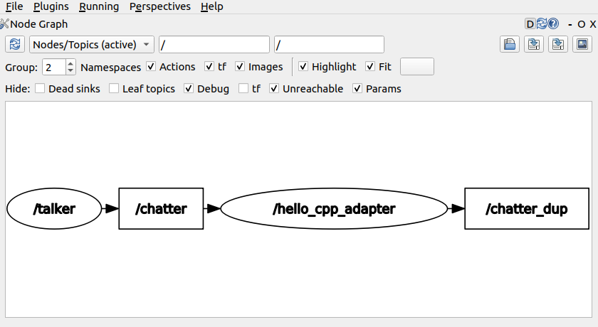
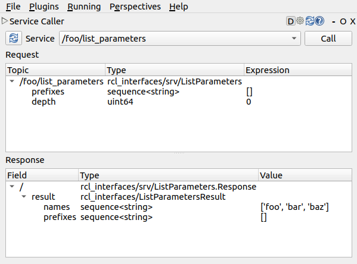

# ROS 2 helper for Connext DDS applications

`rticonnextdds-ros2-adapter` is an open-source C/C++ library to help
applications built with Connext DDS to interact with the
[ROS 2 graph](https://docs.ros.org/en/rolling/Tutorials/Understanding-ROS2-Nodes.html#the-ros-2-graph) and other components of the ROS 2 ecosystem.

## Building

`rticonnextdds-ros2-adapter` provides native APIs for both C and C++.

The libraries can be built using CMake:

```sh
# Clone this repository
git clone https://github.com/asorbini/rticonnextdds-ros2-adapter

# Create a build directory
mkdir build

# Load Connext DDS for your architecture into the environment,
# e.g. load Connext DDS for Linux 64 bit using the provided env script.
source ~/rti_connext_dds-6.0.1/resource/scripts/rtisetenv_x64Linux4gcc7.3.0.bash

# Configure project using cmake: specify a custom install prefix, and
# optionally build included tests and examples.
cmake rticonnextdds-ros2-adapter \
  -Bbuild \
  -DCMAKE_INSTALL_PREFIX=install \
  -DBUILD_TESTING=ON \
  -DBUILD_EXAMPLES=ON \

# Invoke native build tool using cmake and install artifacts.
cmake --build build -- install
```

## Unit tests

In order to build the included unit tests, the respository must have been
configured with `-DBUILD_TESTING=ON`.

Once built, you can ran all included tests using `ctest`:

```sh
(cd build/test && ctest)
```

## Examples

The included examples will only be built if the repository is configured with
`-DBUILD_EXAMPLES=ON`.

You can find all examples in the installation directory under `bin/`.
In order to run them, you will have to add `install/lib` to your shared library
path, e.g. on Linux (assuming that you used `-DCMAKE_INSTALL_PREFIX=install` when configuring the project):

```sh
export LD_LIBRARY_PATH="${LD_LIBRARY_PATH}:install/lib"
```

The examples are written to work out of the box with some ROS 2 applications. In order to run them, you will need a recent version of [ROS 2](https://docs.ros.org/en/rolling/Installation.html) with [rmw_connextdds](https://github.com/ros2/rmw_connextdds) installed.

### hello_c_adapter, hello_cpp_adapter

- These examples will listen for messages on ROS 2 topic `"chatter"` and
  duplicate them on topic "chatter_dup".

- Use the `talker` node from `demo_nodes_cpp` to generate data,
  then start the examples to read it.

  ```sh
  # Start talker in background (or use a different terminal).
  RMW_IMPLEMENTATION=rmw_connextdds ros2 run demo_nodes_cpp talker &

  install/bin/hello_cpp_adapter
  ```

- You can use `rqt`'s "Node Graph" plugin to visualize the example node and
  its endpoints:

  

### parameters_client_cpp

- This example will send a request to the `"list_parameters"` service
  of ROS 2 node `"talker"`.

- Start `demo_nodes_cpp/talker`, then start the client to query it:

  ```sh
  # Start talker in background (or use a different terminal).
  RMW_IMPLEMENTATION=rmw_connextdds ros2 run demo_nodes_cpp talker &

  install/bin/parameters_client_cpp
  ```

### parameters_service_cpp

- This example will advertise a (fake) `"list_parameters"` service.

- Start the service, then use the `ros2 service` utility to interact with it

  ```sh
  # Start service in background (or use a different terminal).
  install/bin/parameters_service_cpp &

  # Query list of available services:
  RMW_IMPLEMENTATION=rmw_connextdds ros2 service list

  # Invoke the service:
  RMW_IMPLEMENTATION=rmw_connextdds ros2 service call \
    /foo/list_parameters rcl_interfaces/srv/ListParameters
  ```

- You can also use `rqt`'s "Service Call" plugin to interact with the service:

  


